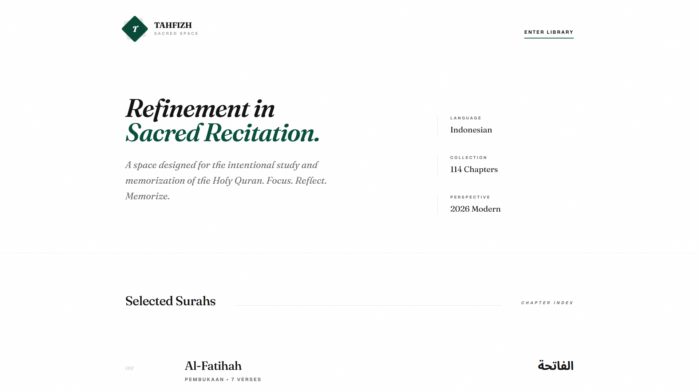

<div align="center">
<a href="https://github.com/fahmirizalbudi/tahfizh" target="blank">

</a>
<br/>

<br />
<br />


</div>

<br />

## Tahfizh

Tahfizh is a handcrafted digital space for intentional Quranic recitation and memorization. Designed for spiritual clarity and focus, it provides a modern and responsive interface for users to engage with the Holy Quran. Developed with React, TypeScript, and Vite, the platform ensures technical reliability and a seamless user experience.

## Preview



## Features

- **Sacred Reading Space:** A focused environment optimized for intentional study and recitation.
- **Intentional Recitation:** Designed to foster spiritual clarity and deep focus during memorization.
- **Modern Quranic Interface:** A contemporary digital experience for accessing the 114 chapters of the Quran.
- **Responsive Architecture:** Adaptable UI/UX optimized for both desktop and mobile environments.
- **High Performance:** Built with Vite for rapid development and optimized production delivery.
- **Type Safety:** Robust codebase maintained through strict TypeScript implementation.
- **Smooth Interactions:** Integrated with Framer Motion for elegant transitions and interactive feedback.

## Tech Stack

- **React**: A JavaScript library for building user interfaces.
- **Vite**: Next-generation frontend tooling for fast development.
- **TypeScript**: A strongly typed programming language that builds on JavaScript.
- **Tailwind CSS**: A utility-first CSS framework for rapid UI development.

## Getting Started

Follow these instructions to set up a local development environment.

### Prerequisites

- **Node.js** and **NPM**.

## Installation

1. **Clone the repository:**

   ```bash
   git clone https://github.com/fahmirizalbudi/tahfizh.git
   cd tahfizh
   ```

2. **Install dependencies:**

   ```bash
   npm install
   ```

3. **Start the development server:**

   ```bash
   npm run dev
   ```

## Usage

### Execution Commands

- **Development:** `npm run dev`
- **Build:** `npm run build`
- **Preview:** `npm run preview`
- **Deploy:** `npm run deploy`

The application will be accessible at [http://localhost:5173](http://localhost:5173).

## License

All rights reserved. This project is intended for educational purposes only and may not be distributed or utilized commercially without explicit permission.
